# online-store
## Table of contents
- [project setup steps](#project-setup)
- [Overview](#overview)
  - [Screenshot](#screenshot)
  - [Links](#links)
- [My process](#my-process)
  - [Built with](#built-with)
  - [What I learned](#what-i-learned)
## Project setup
```
npm install
```

### Compiles and hot-reloads for development
```
npm run serve
```

### Compiles and minifies for production
```
npm run build
```
### Run your production version
```
npm install -g serve
serve -s dist
```
### Start JSON Server and work on the local json db
```
npm install -g json-server

json-server --watch db.json
```
### Run your unit tests
```
npm run test:unit
```
### Customize configuration
See [Configuration Reference](https://cli.vuejs.org/config/).

### Screenshot

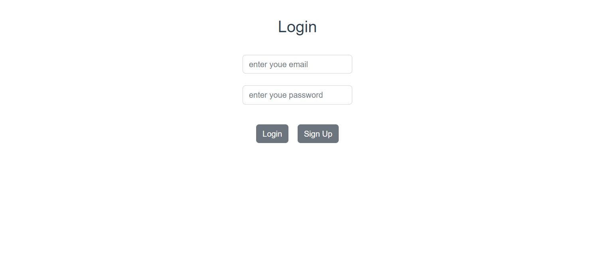

- login as user
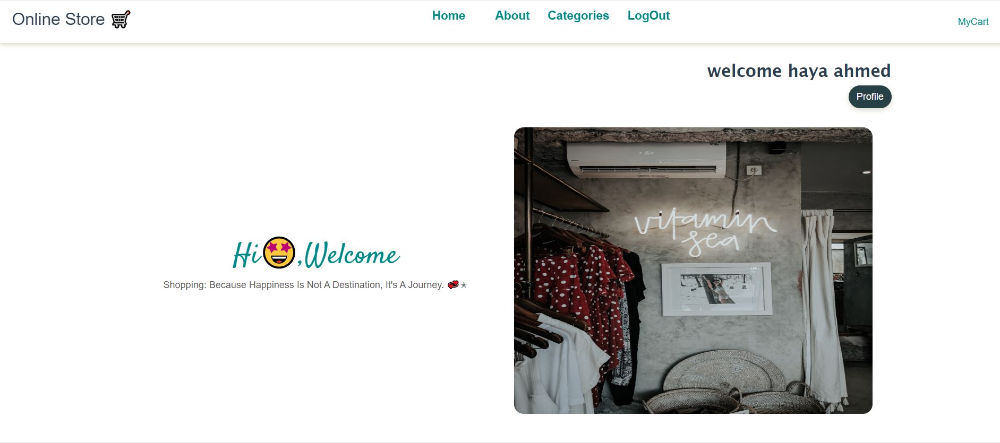
- mobile home
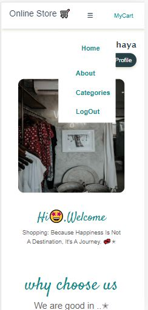

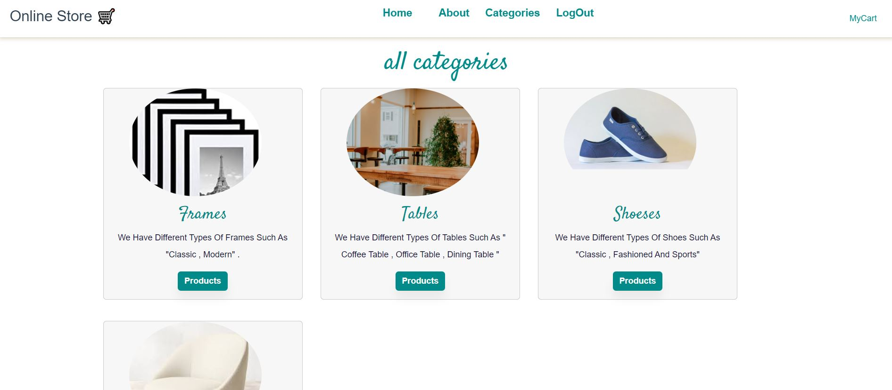
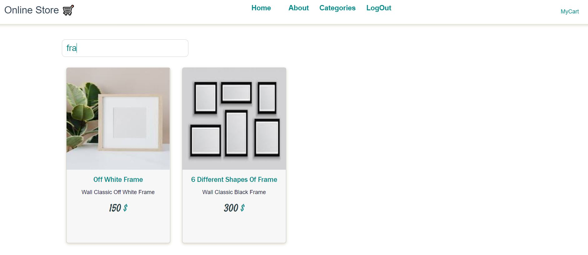

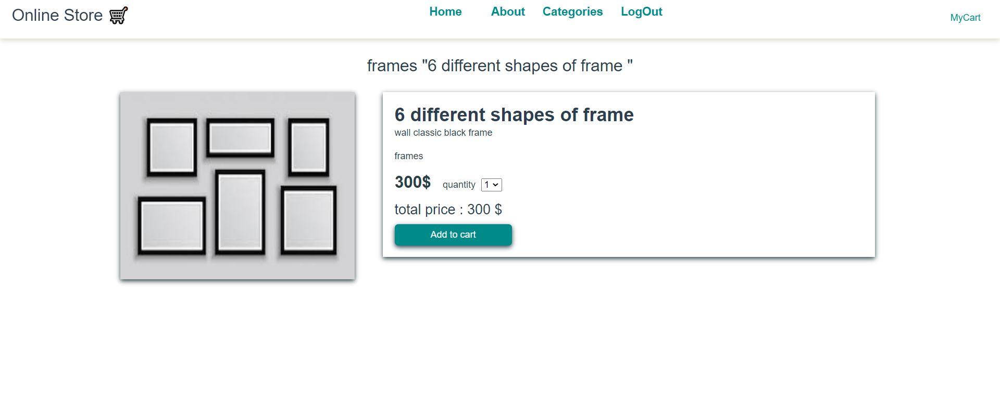
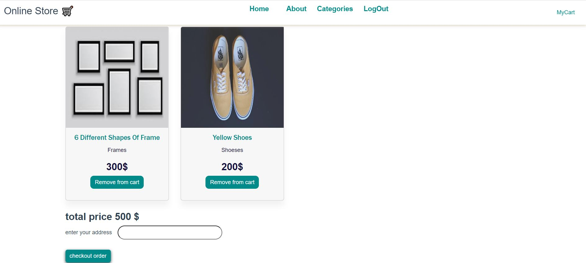 
- login as an admin
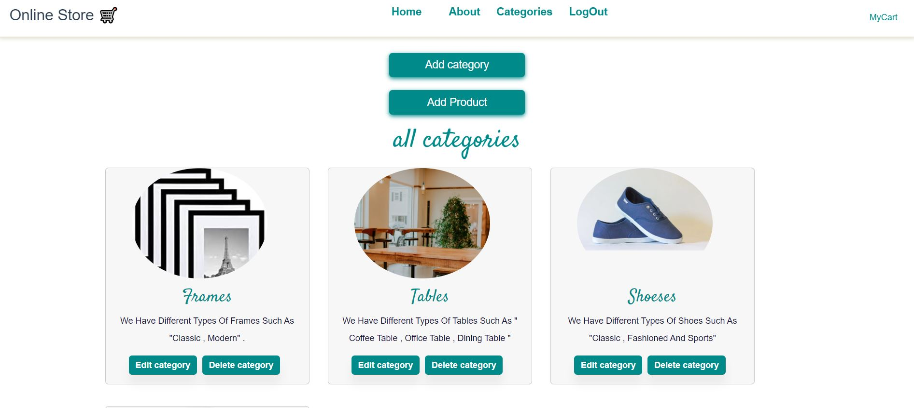
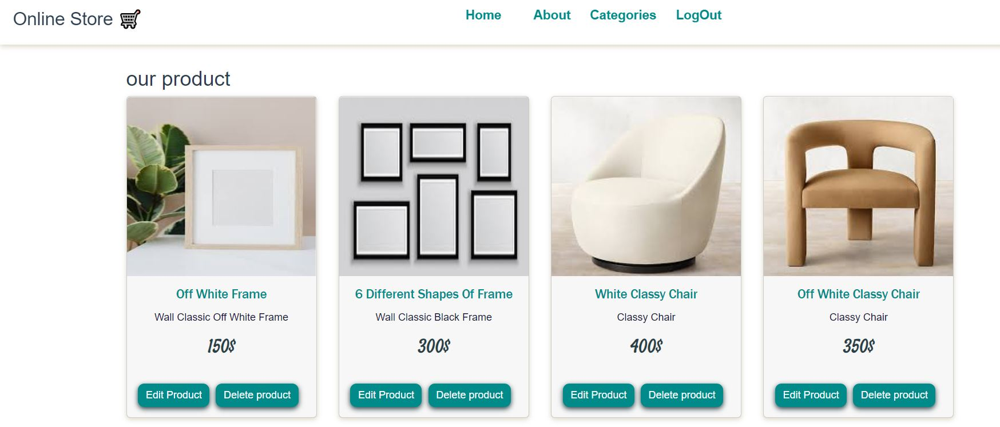
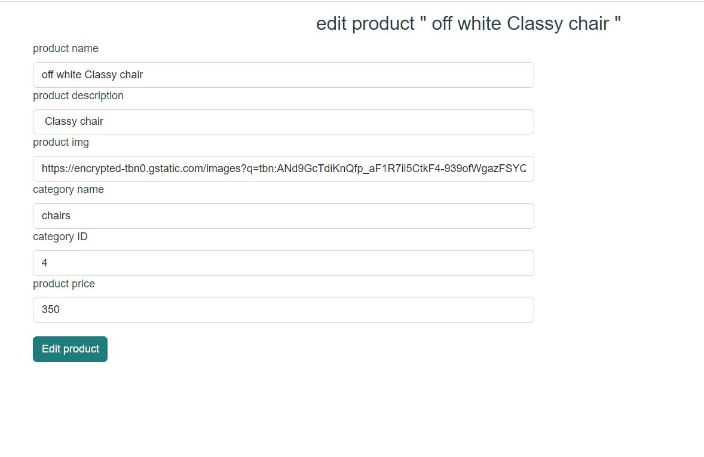
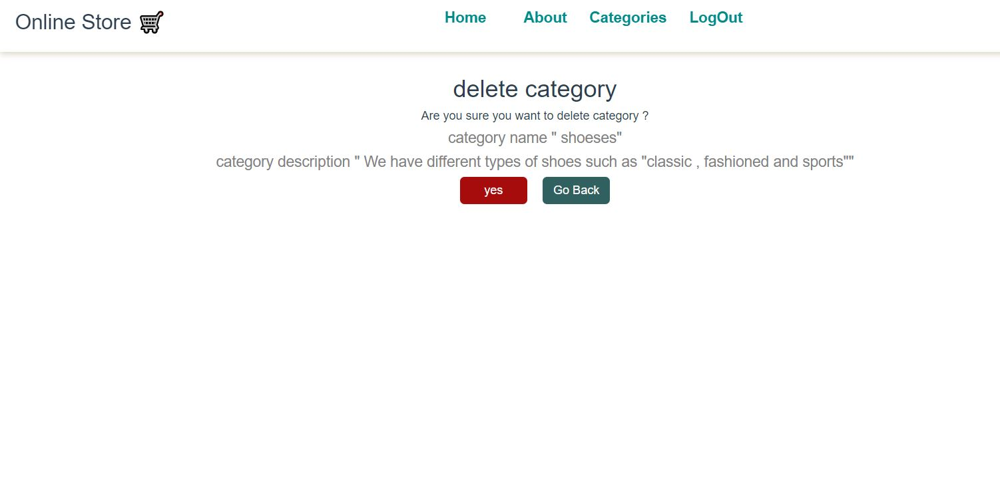

## My process

### Built with

- Semantic HTML5 markup
- CSS custom properties
- Flexbox
- CSS Grid
- Scss
- Bootstrap 5
- [vue](https://vuejs.org/) - JS library
- Rest api
- Axios http-request
- Vuex
- Vuelidate
- Json server

### What I learned
- pass id as a parameter
```html
 <router-link :to="'/ProductV/'+product.id">
   </router-link>
 ```
 - to get this id and use 
  - in routes
  ```js
   {

    path: '/ProductV/:id/',
    name: 'ProductV',
    component: ProductV
  }
  ```
- using in component
 ```js
   data(){
    return{
        productid:this.$route.params.id,
    }
   }
 ```
- train more on rest api with axios methods get ,delete ,put , post ,examples:
```js
asyn getreq()
{
  await axios.get('http://localhost:3000/category').then((mydata)=>{
                    let res = mydata.data;
                  this.cats=res;
                  });   
} 
    let res2=await axios.delete(`http://localhost:3000/product/${this.productid}`);

      async undateit(){
            let result=await axios.put(`http://localhost:3000/category/${this.catid}`,{
            name:this.name,
            desc:this.desc,
            imgurl:this.imgurl,
        }); 
      }

    let result=await axios.post("http://localhost:3000/category",{
                name:this.name,
                desc:this.desc,
                imgurl:this.imgurl
            });                            
```